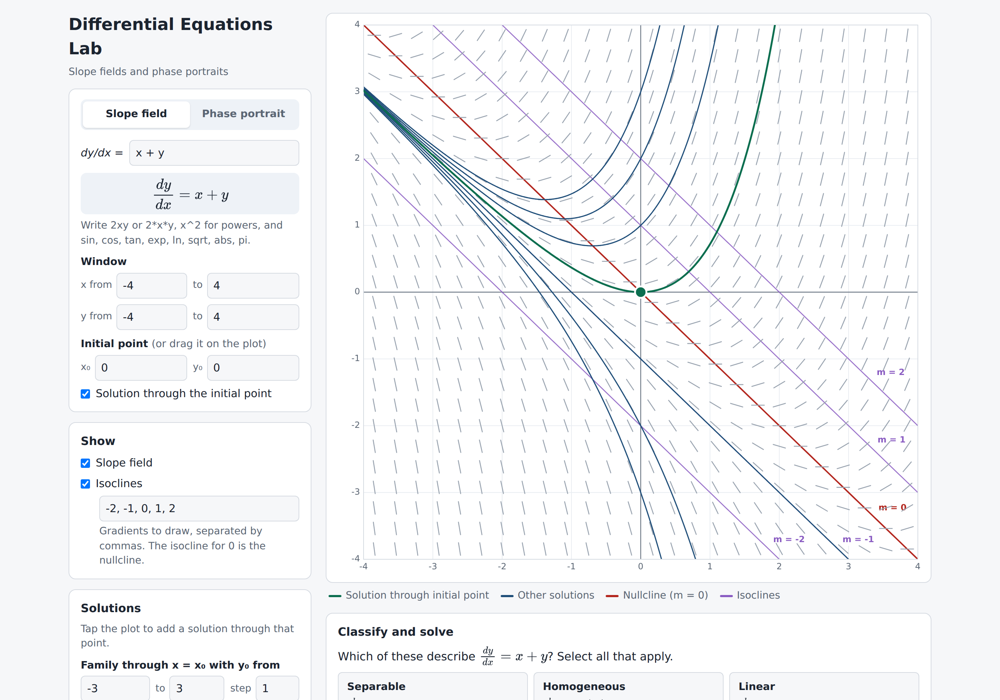
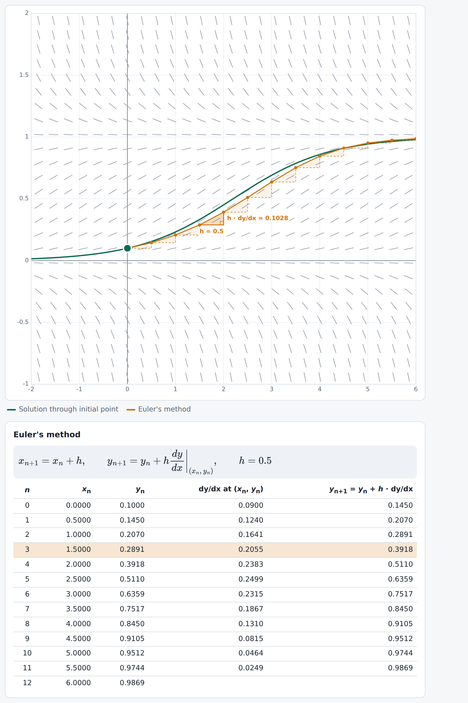
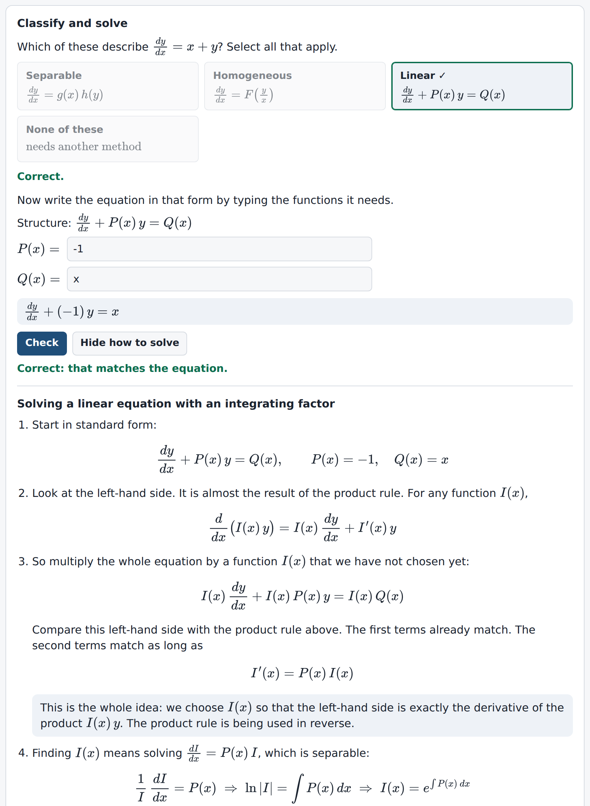
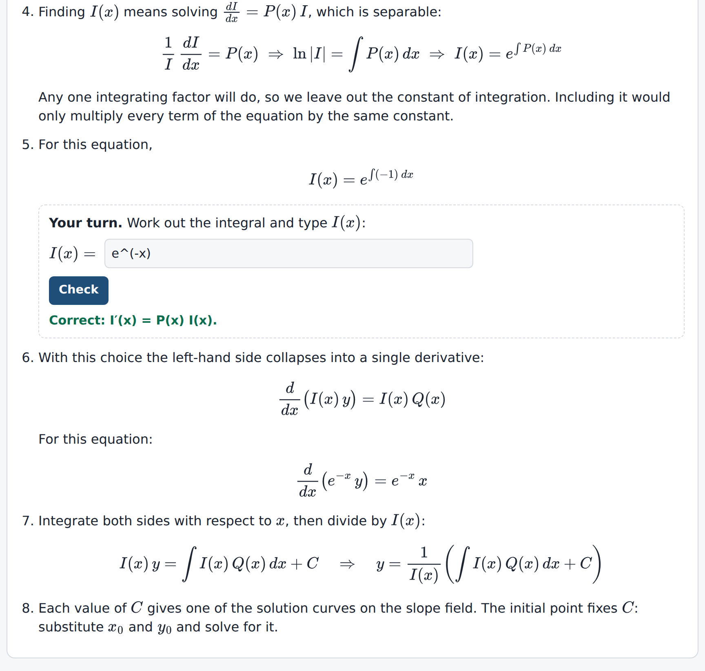
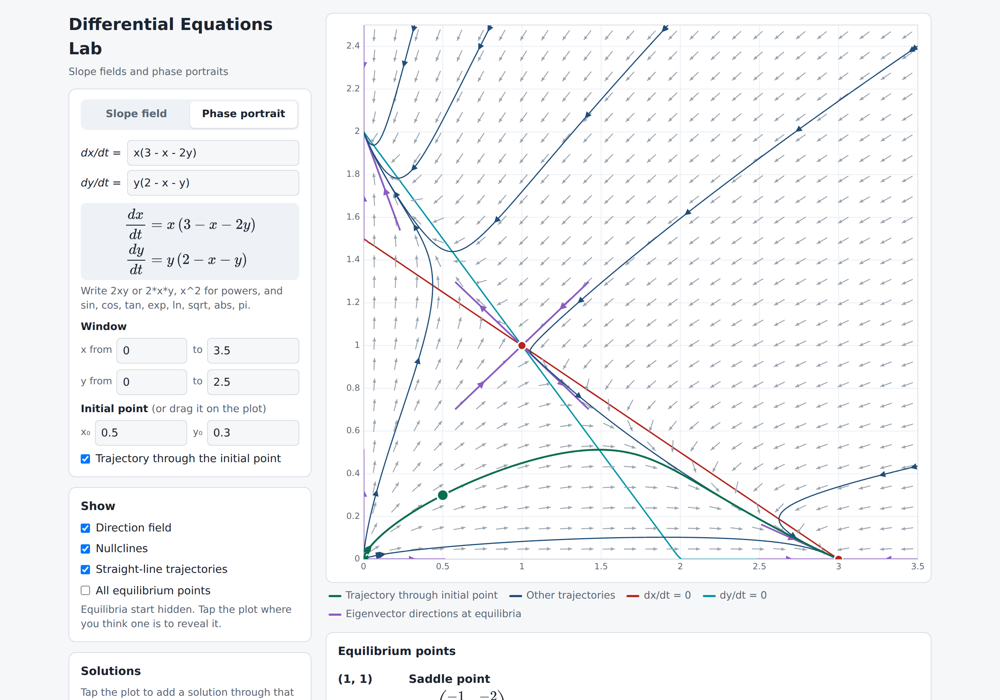
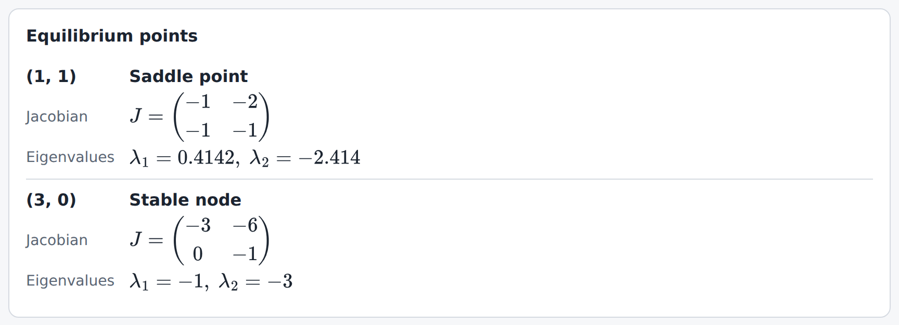
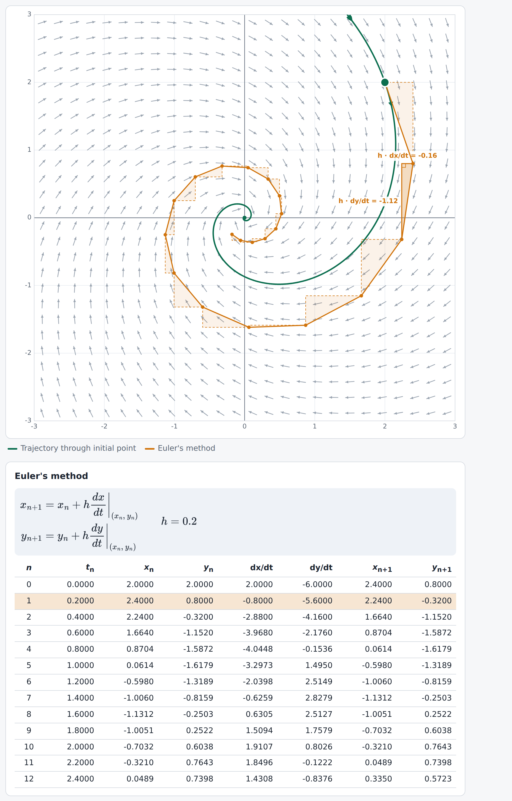
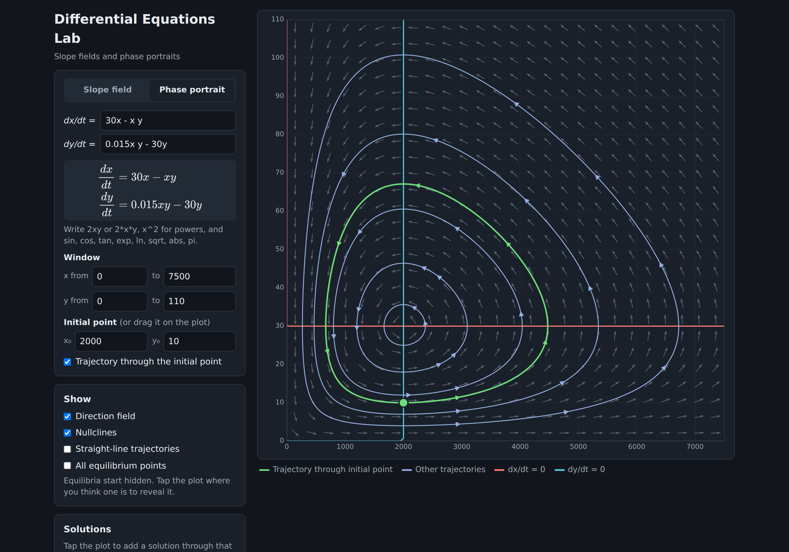

# Differential Equations Lab

**Interactive slope fields and phase portraits for teaching differential equations.**

Type any first-order differential equation or 2D autonomous system and explore it straight away: drag the initial point, trace solutions, step through Euler's method one triangle at a time, and classify equations before solving them. Everything runs in a single HTML file in the browser, with nothing to install.

**[Open the live site](https://liamyardley.github.io/Differential-Equations-Lab/)**



## Why

Free online tools tend to do one thing: plot a slope field, or draw a phase portrait. Very few let students drag an initial condition, see Euler's method built step by step, or find equilibrium points for themselves. Differential Equations Lab was built for the IB Mathematics: Applications and Interpretation HL course, but it suits any course that covers first-order differential equations, coupled systems or numerical methods.

## Features

### Slope fields

- Enter any function f(x, y) for dy/dx = f(x, y). The equation is rendered in LaTeX as you type.
- Set the viewing window and the initial point. The initial point can also be dragged on the plot (or moved with the arrow keys), and the solution through it updates live.
- Tap anywhere to add a particular solution, or add a family of solutions through x = x₀ for a range of y₀ values.
- Show isoclines for any list of gradients. The isocline for m = 0 (the nullcline) is highlighted.

### Euler's method

- Euler's method runs from the initial point, with adjustable step size h and number of steps.
- Step triangles show each step as a right-angled triangle: horizontal leg h, vertical leg h × dy/dx, and the Euler step as the hypotenuse.
- A full table lists n, xₙ, yₙ, dy/dx at (xₙ, yₙ) and yₙ₊₁ = yₙ + h·dy/dx. Tap a row to highlight its triangle on the plot.
- For coupled systems the table shows tₙ, xₙ, yₙ, dx/dt, dy/dt, xₙ₊₁ and yₙ₊₁.



### Classify and solve

A short interactive activity that works for any equation entered, not just the built-in examples.

1. **Classify.** Students choose which of Separable, Homogeneous and Linear apply (or "None of these"). Each option shows its general structure. Incorrect attempts give a hint for each option they have misjudged, without giving the answer away.
2. **Write it in form.** Students type the functions the structure needs: g(x) and h(y), F(v), or P(x) and Q(x). Their answer is checked against the original equation, with targeted feedback (for example, spotting a sign error in P(x)).
3. **How to solve.** Worked notes using the student's own functions:
   - **Linear:** a full explanation of the integrating factor. It shows why multiplying by I(x) turns the left-hand side into d/dx(I y) using the product rule, and how I′ = P I leads to I = e^∫P dx. Students then find I(x) for their equation and it is checked by testing I′(x) = P(x) I(x).
   - **Separable:** why "separating dy and dx" is the chain rule in disguise, and why constant solutions must be found before dividing.
   - **Homogeneous:** the substitution y = vx and why it produces a separable equation.

| Classify | Integrating factor notes |
| --- | --- |
|  |  |

### Phase portraits

- Enter any autonomous system dx/dt = f(x, y), dy/dt = g(x, y).
- Direction field, trajectories with direction arrows, and a draggable initial point.
- Nullclines (dx/dt = 0 and dy/dt = 0) in separate colours.
- Straight-line trajectories along the eigenvectors for linear systems. For nonlinear systems, the eigenvector directions of the linearisation are shown at each equilibrium.
- **Equilibrium points start hidden.** Students tap where they think one is to reveal it, together with its Jacobian, eigenvalues and classification (saddle, stable or unstable node, stable or unstable spiral, centre). A toggle shows them all at once.
- Euler's method for the coupled system, with step triangles and a table.



| Revealed equilibria | Euler's method for a coupled system |
| --- | --- |
|  |  |

### Also

- Built-in examples for both modes, named so that they do not give away the answer to the classification or equilibrium activities. The six linear systems (A to F) cover every type of equilibrium point.
- Light and dark themes follow the device setting.
- Works on phones and tablets (tap and drag).



## Entering functions

| You type | Meaning |
| --- | --- |
| `2xy` or `2*x*y` | 2xy (multiplication can be implied) |
| `x^2`, `e^(-x)` | powers |
| `sin(x)`, `3sinx`, `sin^2(x)` | trigonometric functions |
| `exp(x)`, `ln(x)`, `log(x)` | exponential, natural log, log base 10 |
| `sqrt(x)`, `abs(x)`, `pi` | square root, absolute value, π |

Slope fields use x and y. Phase portraits use x and y for an autonomous system (no t).

## How it works

- **Solution curves and trajectories** use a fourth-order Runge–Kutta method with an adaptive step of fixed size on screen, so curves stay smooth whatever the scale of the window. Trajectories stop at closed orbits, equilibria and vertical asymptotes.
- **Equilibrium points** are found by Newton's method from a grid of starting points, and classified from the eigenvalues of the Jacobian, which is estimated numerically.
- **Classification** (separable, homogeneous, linear) is tested numerically on sample points rather than symbolically:
  - separable: f(x₁, y₁) f(x₂, y₂) = f(x₁, y₂) f(x₂, y₁)
  - homogeneous: f(tx, ty) = f(x, y)
  - linear: f is affine in y for each fixed x
- **Typed equations** are parsed into an expression tree, which is used both to evaluate the function and to produce the LaTeX shown on screen.

## Running locally

Clone the repository (`git clone https://github.com/liamyardley/Differential-Equations-Lab.git`) or download it and open `index.html` in a browser. There is no build step and nothing to install. LaTeX is rendered by [MathJax 3](https://www.mathjax.org/), loaded from the jsDelivr CDN, so an internet connection is needed for the typeset equations; everything else works offline.

## Hosting with GitHub Pages

1. Push the repository to GitHub.
2. Go to **Settings → Pages**.
3. Under **Build and deployment**, choose **Deploy from a branch**, select `main` and `/ (root)`, and save.
4. The site will appear at `https://<username>.github.io/<repository-name>/` after a minute or two.

## Repository structure

```
index.html      the whole app (HTML, CSS and JavaScript in one file)
screenshots/    images used in this README
LICENSE         MIT licence for the code
README.md       this file
```

## Licence

The code is released under the [MIT Licence](LICENSE). The teaching notes and other written content are released under [CC BY-NC-SA 4.0](https://creativecommons.org/licenses/by-nc-sa/4.0/).

## Author

Built by [Liam Yardley](https://github.com/liamyardley), Curriculum Leader for Mathematics. Feedback and suggestions are welcome through GitHub issues.
